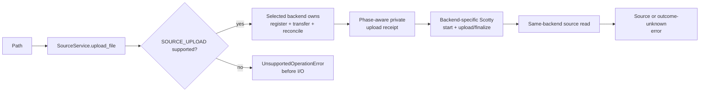
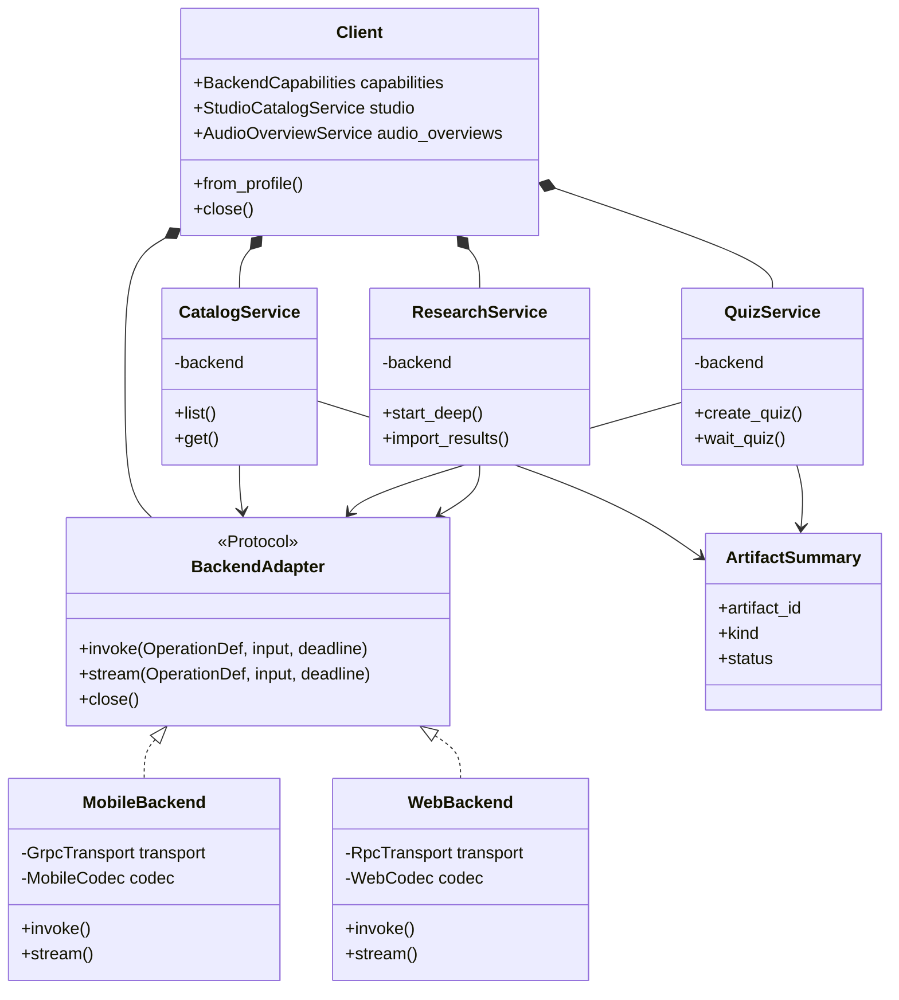

# Responsive Mermaid rendering

At narrow widths, Leaf reflows oversized horizontal flowcharts and uses stacked class cards when
the original two-dimensional class layout cannot fit without wrapping.

## Horizontal flowchart

## Class diagram

